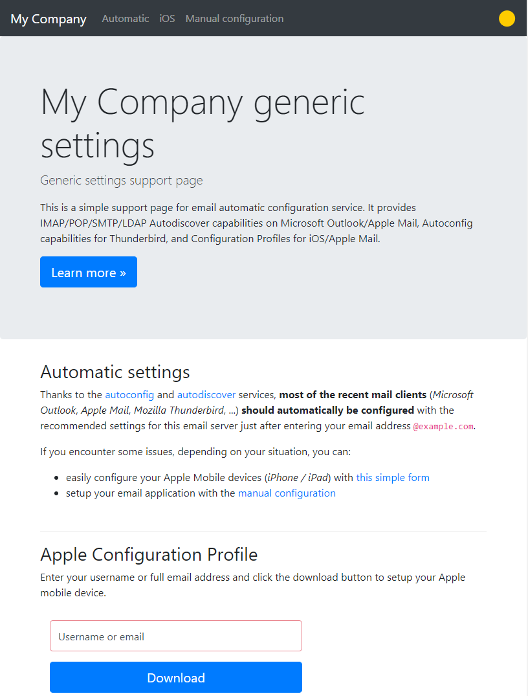
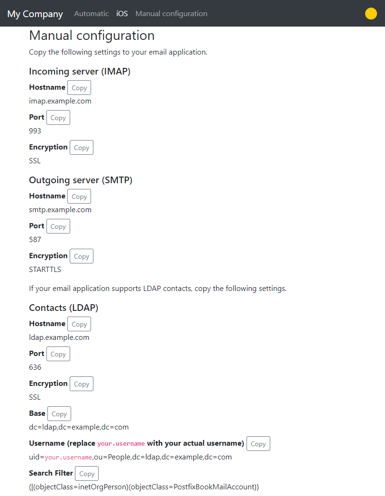

#  Autodiscover Email Settings

[](https://travis-ci.org/Monogramm/autodiscover-email-settings)
[](https://www.codacy.com/gh/Monogramm/autodiscover-email-settings?utm_source=github.com&utm_medium=referral&utm_content=Monogramm/autodiscover-email-settings&utm_campaign=Badge_Grade)
[](https://hub.docker.com/r/monogramm/autodiscover-email-settings/)


This service is created to autodiscover your provider email settings.

It provides IMAP/POP/SMTP/LDAP Autodiscover capabilities on Microsoft Outlook/Apple Mail, Autoconfig capabilities for Thunderbird, and Configuration Profiles for iOS/Apple Mail.

**A simple support page is also available at the root of the autodiscover domain.**





## DNS settings

    autoconfig              IN      A      {{$AUTODISCOVER_IP}}
    autodiscover            IN      A      {{$AUTODISCOVER_IP}}
    imap                    IN      CNAME  {{$MX_DOMAIN}}.
    smtp                    IN      CNAME  {{$MX_DOMAIN}}.
    @                       IN      MX 10  {{$MX_DOMAIN}}.
    @                       IN      TXT    "mailconf=https://autoconfig.{{$DOMAIN}}/mail/config-v1.1.xml"
    _imaps._tcp             IN      SRV    0 0 {{IMAP_PORT}} {{MX_DOMAIN}}.
    _pop3s._tcp             IN      SRV    0 0 {{POP_PORT}} {{MX_DOMAIN}}.
    _submission._tcp        IN      SRV    0 0 {{SMTP_PORT}} {{MX_DOMAIN}}.
    _autodiscover._tcp      IN      SRV    0 0 443 autodiscover.{{$DOMAIN}}.
    _ldap._tcp              IN      SRV    0 0 {{LDAP_PORT}} {{LDAP_HOST}}.

Replace above variables with data according to this table

| Variable        | Description                         |
| --------------- | ----------------------------------- |
| MX_DOMAIN       | The hostname name of your MX server |
| DOMAIN          | Your apex/bare/naked Domain         |
| AUTODISCOVER_IP | IP of the Autoconfig HTTP           |
| IMAP_PORT       | Port for your IMAP server           |
| POP_PORT        | Port for your POP server            |
| SMTP_PORT       | Port for your SMTP server           |
| LDAP_HOST       | The hostname of your LDAP server    |
| LDAP_PORT       | Port for your LDAP server           |

* * *

## Usage

[traefik](https://github.com/containous/traefik) can proxy your containers on docker, on docker swarm, and on a wide range of orchestrators.
You can also achieve this with another proxy like [Nginx](https://www.nginx.com/) for instance.

Though not the preferred solution, it is also possible to run the project without docker, as a `systemd` service.

### docker

```yaml
version: '2'

services:
  autodiscover-example-com:
    image: monogramm/autodiscover-email-settings:latest
    container_name: autodiscover
    environment:
      - COMPANY_NAME=Company
      - SUPPORT_URL=https://autodiscover.example.com
      - DOMAIN=example.com
      # IMAP configuration (host mandatory to enable)
      - IMAP_HOST=imap.example.com
      - IMAP_PORT=993
      - IMAP_SOCKET=SSL
      # POP configuration (host mandatory to enable)
      - POP_HOST=pop3.example.com
      - POP_PORT=995
      - POP_SOCKET=SSL
      # SMTP configuration (host mandatory to enable)
      - SMTP_HOST=smtp.example.com
      - SMTP_PORT=587
      - SMTP_SOCKET=STARTTLS
      # MobileSync/ActiveSync configuration (url mandatory to enable)
      - MOBILESYNC_URL=https://sync.example.com
      - MOBILESYNC_NAME=sync.example.com
      # LDAP configuration (host mandatory to enable)
      - LDAP_HOST=ldap.example.com
      - LDAP_PORT=636
      - LDAP_SOCKET=SSL
      - LDAP_BASE=dc=ldap,dc=example,dc=com
      - LDAP_USER_FIELD=uid
      - LDAP_USER_BASE=ou=People,dc=ldap,dc=example,dc=com
      - LDAP_SEARCH=(|(objectClass=PostfixBookMailAccount))
      # Apple mobile config identifiers (identifier mandatory to enable)
      - PROFILE_IDENTIFIER=com.example.autodiscover
      - PROFILE_UUID=92943D26-CAB3-4086-897D-DC6C0D8B1E86
      - MAIL_UUID=7A981A9E-D5D0-4EF8-87FE-39FD6A506FAC
      - LDAP_UUID=6ECB6BA9-2208-4ABF-9E60-4E9F4CD7309E
    labels:
      - "traefik.port=8000"
      - "traefik.frontend.rule=Host:autoconfig.example.com,autodiscover.example.com"
```

### docker swarm

```yaml
version: '3'

services:
  autodiscover-example-com:
    image: monogramm/autodiscover-email-settings:latest
    container_name: autodiscover
    environment:
      - COMPANY_NAME=Company
      - SUPPORT_URL=https://autodiscover.example.com
      - DOMAIN=example.com
      # IMAP configuration (host mandatory to enable)
      - IMAP_HOST=imap.example.com
      - IMAP_PORT=993
      - IMAP_SOCKET=SSL
      # POP configuration (host mandatory to enable)
      - POP_HOST=pop3.example.com
      - POP_PORT=995
      - POP_SOCKET=SSL
      # SMTP configuration (host mandatory to enable)
      - SMTP_HOST=smtp.example.com
      - SMTP_PORT=587
      - SMTP_SOCKET=STARTTLS
      # MobileSync/ActiveSync configuration (url mandatory to enable)
      - MOBILESYNC_URL=https://sync.example.com
      - MOBILESYNC_NAME=sync.example.com
      # LDAP configuration (host mandatory to enable)
      - LDAP_HOST=ldap.example.com
      - LDAP_PORT=636
      - LDAP_SOCKET=SSL
      - LDAP_BASE=dc=ldap,dc=example,dc=com
      - LDAP_USER_FIELD=uid
      - LDAP_USER_BASE=ou=People,dc=ldap,dc=example,dc=com
      - LDAP_SEARCH=(|(objectClass=PostfixBookMailAccount))
      # Apple mobile config identifiers (identifier mandatory to enable)
      - PROFILE_IDENTIFIER=com.example.autodiscover
      - PROFILE_UUID=92943D26-CAB3-4086-897D-DC6C0D8B1E86
      - MAIL_UUID=7A981A9E-D5D0-4EF8-87FE-39FD6A506FAC
      - LDAP_UUID=6ECB6BA9-2208-4ABF-9E60-4E9F4CD7309E
    deploy:
      replicas: 1
      labels:
        - "traefik.port=8000"
        - "traefik.frontend.rule=Host:autoconfig.example.com,autodiscover.example.com"
```

### nginx

The following is an example of NGinx configuration assuming NGinx for Autodiscover Email Settings located at `autoconfig.example.com` and `autodiscover.example.com`. The following setup assumes NGinx to be running on the host machine and autodiscover to expose itself on port 8000:

```nginx
# HTTP configuration with HTTPS redirection
server {
    listen 80;
    listen [::]:80;
    server_name autoconfig.example.com autodiscover.example.com;
    return 301 https://$server_name$request_uri;
}

# HTTPS configuration with Let's Encrypt certificates
server {
    listen 443 ssl http2;
    listen [::]:443 ssl http2;
    server_name autoconfig.example.com autodiscover.example.com;

    # Set location of error and access logs
    error_log /var/log/nginx/autoconfig.example.com/error.log;
    access_log /var/log/nginx/autoconfig.example.com/access.log combined_ssl;

    # Hide Nginx version
    server_tokens off;

    # SSL configuration (adapt to your environment or managed by Certbot)
    ssl_certificate /etc/letsencrypt/live/autoconfig.example.com/fullchain.pem;
    ssl_certificate_key /etc/letsencrypt/live/autoconfig.example.com/privkey.pem;
    include /etc/nginx/ssl_params;
    include /etc/nginx/header_params;

    location / {
        proxy_set_header X-Real-IP $remote_addr;
        proxy_set_header X-Forwarded-Proto $scheme;
        proxy_set_header X-Forwarded-For $proxy_add_x_forwarded_for;
        proxy_set_header Host $http_host;

        # Enable HSTS once SSL configuration fully validated
        #add_header Strict-Transport-Security "max-age=15552000; includeSubDomains" always;
        add_header Front-End-Https on;

        # Redirect NGinx traffic to locally running autodiscover
        # if NGinx is running inside docker, adapt to either DOCKER_HOST or docker container name
        proxy_pass http://127.0.0.1:8000;

        proxy_redirect off;
    }
}
```

### service

The following is an example of `systemd` service configuration for Autodiscover Email Settings. The following setup assumes the following:
- `node` and `yarn` are installed on your marchine
- project is located at `/srv/http/autodiscover`
- the project dependencies have been previously installed with `yarn --prod`
- there is an `autodiscover` user and group with sufficient permissions to read the project and run `node`

```properties
[Unit]
Description=Autodiscover service

[Service]
Type=simple
WorkingDirectory=/srv/http/autodiscover
User=autodiscover
Group=autodiscover
Environment="NODE_ENV=production"

#Environment="COMPANY_NAME=Company"
#Environment="SUPPORT_URL=https://autodiscover.example.com"
#Environment="DOMAIN=example.com"

# IMAP configuration (host mandatory to enable)
Environment="IMAP_HOST=imap.example.com"
Environment="IMAP_PORT=993"
Environment="IMAP_SOCKET=SSL"

# POP configuration (host mandatory to enable)
#Environment="POP_HOST=imap.example.com"
#Environment="POP_PORT=995"
#Environment="POP_SOCKET=SSL"

# SMTP configuration (host mandatory to enable)
Environment="SMTP_HOST=imap.example.com"
Environment="SMTP_PORT=465"
Environment="SMTP_SOCKET=SSL"

# MobileSync/ActiveSync configuration (url mandatory to enable)
#Environment="MOBILESYNC_URL=https://sync.example.com"
#Environment="MOBILESYNC_NAME=sync.example.com"

# LDAP configuration (host mandatory to enable)
#Environment="LDAP_HOST=ldap.example.com"
#Environment="LDAP_PORT=636"
#Environment="LDAP_SOCKET=SSL"
#Environment="LDAP_BASE=dc=ldap,dc=example,dc=com"
#Environment="LDAP_USER_FIELD=uid"
#Environment="LDAP_USER_BASE=ou=People,dc=ldap,dc=example,dc=com"
#Environment="LDAP_SEARCH=(|(objectClass=PostfixBookMailAccount))"

# Apple mobile config identifiers (identifier mandatory to enable)
Environment="PROFILE_IDENTIFIER=com.example.autodiscover"
Environment="PROFILE_UUID=92943D26-CAB3-4086-897D-DC6C0D8B1E86"
Environment="MAIL_UUID=7A981A9E-D5D0-4EF8-87FE-39FD6A506FAC"
#Environment="LDAP_UUID=6ECB6BA9-2208-4ABF-9E60-4E9F4CD7309E"

ExecStart=/usr/bin/node /srv/http/autodiscover/index.js
Restart=always

[Install]
WantedBy=multi-user.target

```

## Credits

Inspired from <https://github.com/sylvaindumont/autodiscover.xml>, but without the few restrictions mentioned in the original project notes and with a simple support page to allow manual setup and iOS profile download.

The original project was inspired from <https://github.com/johansmitsnl/docker-email-autodiscover>, but with <https://github.com/Tiliq/autodiscover.xml> instead of <https://github.com/gronke/email-autodiscover> to allow a much lighter image based of node on alpine instead of apache on debian.

Thanks to [@HLFH ](https://github.com/HLFH) for providing sample NGinx configuration and systemd service configuration.

## Notes

The above autoconfiguration methods assume the following:

-   If username does not contain `@`, full email address will be generated based on domain settings

## Links

-   Mozilla [Autoconfig configuration](https://developer.mozilla.org/en-US/docs/Mozilla/Thunderbird/Autoconfiguration/FileFormat/HowTo)

-   Microsoft [Exchange Command Reference](https://docs.microsoft.com/en-us/openspecs/exchange_server_protocols/ms-ascmd/1a3490f1-afe1-418a-aa92-6f630036d65a)

-   Apple [ConfigurationProfile reference](https://developer.apple.com/library/archive/featuredarticles/iPhoneConfigurationProfileRef/index.html)

-   [DNS SRV Records for LDAP](https://github.com/doctorjbeam/LDAPAutoDiscover)

-   [Bootstrap](https://getbootstrap.com/), [jQuery](https://jquery.com/) and [Popper.js](https://popper.js.org/) used for default support page

## License

This project is distributed under the [MIT License](LICENSE)
